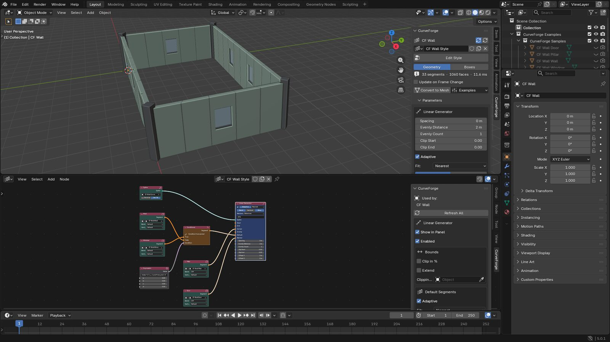
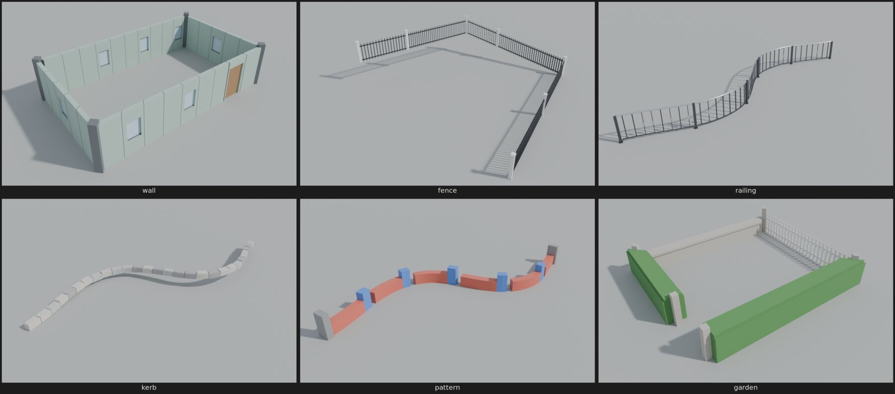
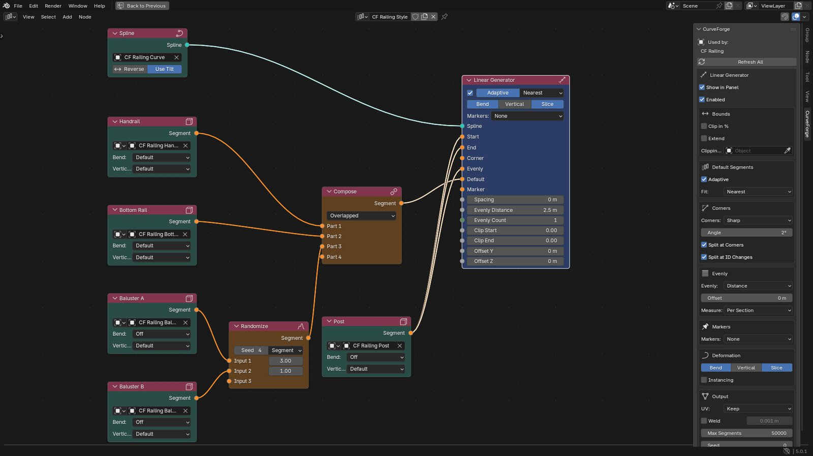
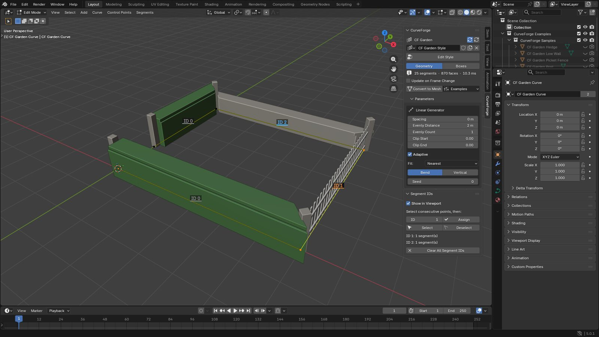
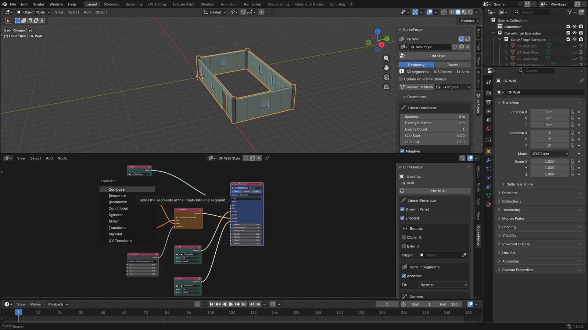

# CurveForge — node-based scattering along curves for Blender

CurveForge repeats and adapts objects along curves, the way RailClone does in
3ds Max. You build a **style** in a node editor (the equivalent of RailClone's
Style Editor): Spline and Segment nodes feed operators and a Linear Generator,
which lays the segments out along the curves. The result is a live mesh object
that updates while you edit the curves, the segment objects or the nodes.



* Blender **4.2 LTS to 5.x** (tested on 4.2.23 and 5.0.1).
* The output is a regular mesh object (plus an automatic Geometry Nodes
  modifier when instancing is used): it renders anywhere, keeps materials, UVs
  and attributes, and accepts other modifiers. *Convert to Mesh* makes a plain
  copy that no longer depends on the add-on.
* Italian guide: [README.it.md](README.it.md).

## Installation

1. Download `dist/curveforge-1.0.0.zip` (or build it with `python build.py`).
2. In Blender: *Edit → Preferences → Get Extensions → ⌄ → Install from Disk…*
   and pick the zip (or drag the zip into the Blender window).
3. The tools are in the 3D View sidebar (`N`) → **CurveForge** tab, in
   *Add → New Curve Scatter / CurveForge Example*, and in the node editor
   (editor type **CurveForge Style**).

## Quick start

1. Model a segment along **+X** with **+Z up**. The curve runs through the
   object origin: Y = 0 is on the curve, Z = 0 is the height of the curve.
2. Draw a curve (Bezier, Poly or NURBS, open or closed, one or more splines).
3. Select the segment, then the curve (active) and press **New Curve Scatter**
   in the CurveForge tab. You get a CurveForge object and its style:
   `Spline → Linear Generator ← Segment (Default)`.
4. Press **Edit Style** to open the style in a node editor. Add nodes with
   `Shift+A` (Input, Generator, Operator, Number, Layout) and connect them.
5. Everything is live: move curve points, edit the segment objects, change node
   values.

*Add → CurveForge Example* builds six ready-made styles (wall, fence, railing,
kerb, pattern, garden border) to take apart.



## How a style works

```
Spline ─────────────────────────────┐
Segment ── Operators (optional) ────┼──▶ Linear Generator ──▶ CurveForge object
Value / Segment Info / Math ... ────┘     (Start, End, Corner, Evenly, Default, Marker)
```

The **Linear Generator** splits every spline into *sections* (at corners,
markers and Segment ID changes) and fills them:

| Input | Placed |
|-------|--------|
| **Start / End** | At the beginning and at the end of open splines. |
| **Corner** | On the corners (points turning more than the angle, or every point). |
| **Evenly** | At regular distances (or a count) inside every section. |
| **Marker** | At chosen points, distances (`2.5, 50%, -1`) or every *Step*. |
| **Default** | Repeated to fill what is left. **Adaptive**: stretched so that a whole number fits; otherwise real size with an alignment and a remainder (slice, scale or empty). |

Operators sit between segments and the generator and are evaluated **for every
segment that is placed**, with variables such as its index, the distance along
the spline, the section, the Segment ID or the slope. Number nodes can be
connected to any number socket (spacing, evenly distance, offsets, transforms,
conditions…), so every parameter can change along the curve.



## Node reference

### Input

* **Spline** — a curve object. *Splines* picks some of its splines (`0, 2, 4-6`,
  empty = all). *Reverse*, *Resolution* (steps per curved segment, 0 =
  automatic), *Twist* (*Z Up* keeps segments level, *Minimum* for 3D paths),
  *Use Tilt*. Several Spline nodes can feed one generator.
* **Segment** — the geometry to repeat: an **Object** (mesh, curve, text…, with
  its modifiers) or a **Collection** used at *Random* (weights listed in the
  node sidebar), in *Sequence*, or *Combine* (all objects as one segment,
  collection origin as pivot). Per segment:
  * *Bend / Vertical / Slice / Instance*: Default (use the generator), On, Off.
    *Bend* deforms the segment along the curve with mitered corners; *Vertical*
    keeps it upright on slopes (shear instead of tilt); *Slice* lets the
    generator cut it at the ends and at clipping areas.
  * *Adaptive*: whether the segment may be stretched when fitting.
  * *Alignment* X (Auto, Pivot, Left, Center, Right), Y and Z, plus *Offset*.
  * *Rotation*, *Scale*, *Mirror* X/Y/Z, *Custom Size* (length taken on the
    curve), *Padding* (space before and after), *Corner Orientation*
    (bisector, incoming or outgoing direction) for segments placed on corners.
* **Empty Segment** — a gap of the given *Length* (its socket can be driven).

### Generator

* **Linear Generator** — lays segments along the connected splines.
  * Inputs: *Spline*, *Start*, *End*, *Corner*, *Evenly*, *Default*, *Marker*,
    and the number sockets *Spacing*, *Evenly Distance*, *Evenly Count*,
    *Clip Start*, *Clip End*, *Offset Y*, *Offset Z*.
  * Bounds: clip the splines (distance or %), *Extend* past the ends with
    negative values, *Clipping Area* (closed curve, keep inside or outside, the
    segments are sliced on its border).
  * Default segments: *Adaptive* with *Fit* Nearest / Shrink / Stretch / Count,
    or real size with *Align* (start, center, end, spread) and *Remainder*
    (slice, scale, empty).
  * Corners: *Sharp* (angle threshold), *All Points* or *None*; *Split at
    Corners*; *Split at ID Changes*.
  * Evenly: by distance or count, *Offset*, measured per section or over the
    whole spline.
  * Markers: *Points* (`1, 3, 5-7, all`), *Distances* (`2.5, 50%, -1`, negative
    from the end) or *Repeat* (every *Step* from *Offset*).
  * Deformation defaults (*Bend*, *Vertical*, *Slice*, *Instancing*), output
    *UV* (keep, or U along the curve with a scale), *Weld*, *Max Segments*,
    *Seed*.

### Operators

* **Compose** — joins its inputs into one segment, one after the other or
  overlapped (same origin), with an optional gap.
* **Sequence** — uses the inputs in turn; every input socket has a *Count*.
  Restarts every spline, section, generator input or never; *Offset*.
* **Randomize** — picks an input at random; every input socket has a *Weight*.
  New choice per segment or per spline; *Seed*.
* **Conditional** — chooses *True* or *False* by comparing a variable with a
  value (=, ≠, <, ≤, >, ≥, between, even, odd, every N), or with the
  *Condition* socket (any number node, e.g. an Expression).
* **Selector** — uses the input whose number is a variable (default: the
  Segment ID) or the *Index* socket; out of range: wrap, clamp or nothing.
* **Mirror** — mirrors on X/Y/Z always, every other segment or at random.
* **Transform** — *Offset*, *Rotation*, *Scale* sockets (drivable per segment)
  plus random offset, rotation (with steps) and scale.
* **Material** — replaces all materials or one slot with the first, a random, a
  sequence or an indexed material (up to 8).
* **UV Transform** — offset, scale, rotation and random offset of the UVs.

### Number

* **Value**, **Integer**, **Combine XYZ**.
* **Segment Info** — a variable of the segment being placed (table below).
* **Math** — add, subtract, multiply, divide, power, min, max, modulo, snap,
  abs, negate, floor, ceil, round, sine, cosine, clamp, multiply-add, lerp,
  comparisons, between, and/or/not, even, odd, every.
* **Random Value** — between *Min* and *Max*, per segment, per spline or per
  index, optionally integer.
* **Expression** — a formula with the variables, the inputs `a b c d`, the
  functions `abs min max round int floor ceil sqrt sin cos tan asin acos atan
  atan2 radians degrees pow log exp clamp lerp step sign fract mod` and
  `x if cond else y`. Example: `index % 3 == 1 and from_end > 0`.

| Variable | Meaning |
|----------|---------|
| `index` | Index of the segment among those of the same input on the spline |
| `global_index` | Index among all inputs of the spline |
| `input` | Generator input: 0 Default, 1 Start, 2 End, 3 Corner, 4 Evenly, 5 Marker |
| `section`, `section_index`, `section_count`, `from_end` | Section number, index inside it, Default segments in it, segments left until its end |
| `distance`, `distance_pct` | Distance from the start of the spline (length, or 0–1) |
| `spline_length`, `section_length` | Lengths |
| `spline`, `spline_material` | Spline number and its material index |
| `segment_id` | Segment ID of the curve under the segment |
| `marker` | Marker number |
| `corner_angle` | Turning angle of the corner in degrees |
| `slope` | Slope of the curve in degrees (positive uphill) |
| `x`, `y`, `z` | World position of the segment start |
| `random` | Random value 0–1, different for every segment |

## Segment IDs

The equivalent of the spline material IDs of RailClone: an integer per curve
segment (between two points). In Edit Mode on the curve, select consecutive
points and use the **Segment IDs** panel (*Assign*, *Select*, *Deselect*,
*Clear*). The IDs are shown in the viewport and follow their points when the
curve is edited. Use them with a **Selector** (it reads `segment_id` by
default), a Conditional or any number node; ID changes also split sections.



## More

* **Exported parameters** — turn on *Show in Panel* on any node (node editor
  sidebar → CurveForge): its settings appear in the 3D View sidebar under
  *Parameters*, so a style can be tuned without opening the node editor.
* **Instancing** — rigid segments (Bend off, not sliced) can be placed as
  instances of their objects (generator *Instancing* or per segment *Instance*);
  CurveForge manages a small Geometry Nodes modifier for that. Lighter scenes,
  the original objects keep their modifiers and materials.
* **Display** — *Boxes* shows bounding boxes for heavy segments; the panel shows
  segments, faces and build time; *Max Segments* protects from mistakes.
* **Animation** — node values can be animated; *Update on Frame Change*
  rebuilds on every frame (also for animated curves).
* **Styles are node trees**: several objects can share one style, styles can be
  duplicated and appended from other files.



## RailClone → CurveForge

| RailClone | CurveForge |
|-----------|------------|
| Style Editor | node editor *CurveForge Style* |
| Linear 1S generator (Start, End, Corner, Evenly, Default, Marker) | Linear Generator |
| Spline / Segment / empty segment | Spline / Segment / Empty Segment |
| Compose, Sequence, Randomize, Conditional, Selector, Mirror, Transform, Material, UVW Xform | same names |
| Constant, Arithmetic, Random, Segment parameters, Expression | Value / Integer, Math, Random Value, Segment Info, Expression |
| Spline material IDs | Segment IDs |
| Clipping area, Extend, Clip spline | Clipping Area, Extend, Clip Start / End |
| Bend, Vertical, Slice, Adaptive, alignment, padding | same, per generator and per segment |
| Instancing, Weld, real-world UVs | Instancing, Weld, UV *Along Curve* |
| Exported parameters | *Show in Panel* |

Not included: the Array 2S (two-spline grid) generator, macros (node groups)
and lights as segments.

## Development

* `curveforge/engine/` — pure numpy engine (sampling, rail deformation, layout,
  operators, mesh assembly), testable without Blender.
* `curveforge/*.py` — Blender side: node editor, compiler from nodes to engine
  sources, mesh I/O, live updates, panels, operators, examples.
* Tests: `pip install bpy==4.2.* pytest` (or `bpy==5.0.*`), then
  `python -m pytest tests`.
* Package: `python build.py` → `dist/curveforge-<version>.zip`.

License: GPL-3.0-or-later.
