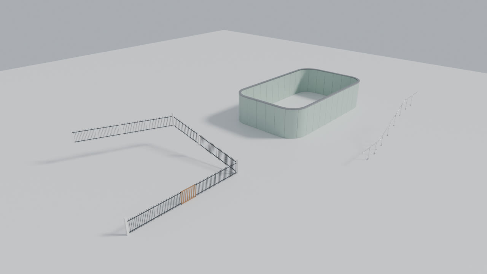

# ParamOps — parametric scattering along curves for Blender

ParamOps repeats and adapts meshes along curves, in the spirit of RailClone for
3ds Max, without Geometry Nodes. You assign meshes to sample slots, pick a
curve, and the scatter builds itself. It stays live while you edit the curve,
the sample meshes or the settings.



* Works with Blender **4.2 LTS → 5.x** (tested on 4.2.23 and 5.0.1).
* The result is a regular mesh object, so it renders anywhere (render farms do
  not need the add-on), keeps materials, UVs and attributes, and accepts
  modifiers (Weld, Bevel, Smooth by Angle, …).

## Installation

1. Download `dist/paramops-1.0.0.zip` (or build it with `python build.py`).
2. In Blender: *Edit → Preferences → Get Extensions → ⌄ → Install from Disk…*
   and pick the zip.
3. The panel is in the 3D View sidebar (`N`) → **ParamOps** tab.

## Quick start

1. Model a module (for example a 2 m fence panel) along **+X**, with **+Z up**.
   The curve passes through the object origin: Y = 0 is on the curve and Z = 0
   is the height of the curve.
2. Draw a curve (Bezier, Poly or NURBS; open or closed, one or more splines).
3. Select the module, then the curve (active) and click **New Scatter** in the
   ParamOps tab. With only a mesh selected, *New Scatter + Curve* also adds a
   curve.
4. Fill the other slots (Start, End, Evenly, Corner), add Segment IDs and
   Markers, and tune the settings. Everything updates live.

Try **Demo Scene** in the panel for a ready-made example (fence on a slope with
corner posts, evenly spaced posts and a gate; a wall with round corners; a
stair handrail with supports).

## Features

### Sample slots

| Slot | What it does |
|------|--------------|
| **Default** | The main module repeated along the curve. It stretches and adapts to fill the length. |
| **Start / End** | Placed at the beginning and at the end of open curves to close the scatter cleanly (End has a quick *Mirror* toggle). |
| **Evenly** | Placed at regular intervals inside every section (between corners, markers, start and end). |
| **Corner** | Placed on the corners of the curve. Corners always split the scatter into sections, even without a corner sample. |
| **Segment IDs** | Replace the Default sample on chosen segments of the curve. An ID without an object leaves a hole. |
| **Markers** | Pin a sample (door, gate, lamp…) to chosen points of the curve, or at distances / percentages. |

Every slot accepts an **Object** or a **Collection**. Collections can be used
in three ways: **Random** (weighted, the weight is shown next to every object),
**Sequence** (A, B, C, A, B, C…), or **Combine** (all objects together form one
module; the collection origin is the pivot).

Per-slot options (expand the slot with the arrow):

* **Deform to Curve**: bends the sample along the curve, with exact miter joints
  on sharp corners. Off = rigid placement (chord or point).
* **Keep Vertical (slopes)**: on slopes the sample stays upright and is sheared
  instead of tilted (fences, railings, facades).
* **Flat Top / Flat Center / Flat Bottom**: keep the top and/or bottom band of
  sheared samples horizontal (post caps, plinths), or level the whole sample.
* **Anchor / Side / Height alignment**: pivot, bounding-box centre, left/right,
  bottom/top.
* **Orientation** for corner samples: bisector, incoming or outgoing direction.
* **Offset, Rotation, Scale, Mirror X/Y, Padding** before/after.
* **Randomize**: offset, rotation, scale, flip probability, UV offset (per copy),
  seed.

### Default fitting

* **Adaptive**: a whole number of copies, stretched or squashed to fit exactly
  (plus *Shrink only* and *Stretch only* variants).
* **Count**: a fixed number of copies per section.
* **Real Size**: no stretching; align to start / centre / end or distribute,
  and fill the remainder with a *sliced* or *scaled* copy, or leave it empty.
* **Spacing** between copies (negative values overlap them).

### Evenly

* **Spacing**: exact distance, with **Min Gap** (the last sample is dropped
  when it would be closer than this to the end of the section) and alignment.
* **Fit**: equal intervals never longer than the spacing.
* **Count**: a fixed number per section.

### Corners

* **Corner Angle**: control points that turn more than this are corners.
* **Corner Radius**: rounds the corners of the curve non-destructively; the
  modules bend around the arcs.
* **Corner Slide**: moves the section break (and the corner sample) along the
  curve.

### Segment IDs and Markers (Edit Mode)

Select the curve, enter Edit Mode (*Edit Curve* button), then:

* **Segment IDs**: select the two end points of one or more segments, choose
  an ID and press **Assign**. *Remove*, *Select* and *Deselect* work the same
  way, and the panel shows how many segments are assigned.
* **Markers**: select points and press **Place**. Marker positions can also be
  typed in the *At* field: `2.5, 50%, -1` (distance, percentage, distance from
  the end).

Assignments follow their points when you move, subdivide, delete or reverse
the curve.

### Curve options

Reverse direction, trim or extend the ends (distance or percentage), side and
height offset, twist mode (Z-Up or Minimum for 3D paths), curve tilt, curve
resolution (automatic by default).

### Conform to Surface

Drops the curve onto a mesh (terrain) along −Z, sampled every *Step*. Combined
with *Keep Vertical*, fences follow the ground and stay upright.

### Options and tools

* **Live Update** toggle and **Refresh** (one or all scatters).
* **Display: Boxes** for fast previews of heavy scatters.
* **Max Samples** safety limit, **Seed**, **Update on Frame Change** for
  animated curves.
* **Use Sample Rotation/Scale**: the sample's own rotation and scale are applied
  (its location is ignored).
* **Convert to Mesh** (keep the scatter or replace it), **Copy to Selected**
  (copies samples and settings to other scatters).
* Several scatters can share one curve; the panel lets you switch between them
  when the curve is active.

## Tips for modelling samples

* Build modules along +X. The bounding box along X defines the length used for
  fitting (use *Padding* to add space).
* Add subdivisions along X to modules that must bend (rails, walls, kerbs).
* Keep sample objects in a separate collection, hidden in the viewport (eye
  icon) and disabled in renders. Objects in excluded collections also work, but
  their modifiers are ignored.
* Add a *Weld* modifier to the scatter to merge the copies, and *Smooth by
  Angle* for shading.

## RailClone feature map

| RailClone (Linear 1S) | ParamOps |
|---|---|
| Start, End, Default, Evenly, Corner, Marker segments | Same slots |
| Adaptive mode, X spacing, Count | Fit: Adaptive / Shrink / Stretch / Count, Spacing |
| Real size + Slice | Fit: Real Size, Remainder: Slice / Scale / Empty |
| Material IDs to switch segments | Segment IDs |
| Markers by vertex / by distance | Markers by point / *At* field |
| Bend deformation, Vertical mode | Deform to Curve, Keep Vertical, Flat Top/Bottom |
| Randomize / Sequence / Compose operators | Collection: Random (weights) / Sequence / Combine |
| Transform & Mirror operators, UVW XForm random | Offset / Rotation / Scale / Mirror / Random (incl. UV) |
| Clipping / extend | Trim (distance or %), negative values extend |
| — | Round Corners, Corner Slide, Conform to Surface |

The 2D grid generator (Array 2S) is not part of ParamOps: it focuses on
scattering along curves.

## Development

```
paramops/            add-on package (extension, manifest included)
  core/              pure numpy: curve sampling, path frames, layout, placement
  builder.py         turns the settings into the scatter mesh
  handlers.py        live update (depsgraph, undo, frame change)
  props.py ops.py ui.py samples.py writer.py curves.py demo.py
tests/               unit tests (numpy) + Blender integration and UI tests
build.py             builds dist/paramops-<version>.zip
```

Run the tests with Blender's Python module (`pip install bpy pytest`, matching
Python 3.11):

```
python -m pytest tests
```

Without Blender the integration tests are skipped and the core tests still run.

## Guida rapida (Italiano)

1. **Installazione**: Blender 4.2 o superiore → *Modifica → Preferenze → Get
   Extensions → Install from Disk…* e scegli `dist/paramops-1.0.0.zip`. Il
   pannello è nella barra laterale della vista 3D (`N`), scheda **ParamOps**.
2. **Modella il modulo** lungo l'asse **+X** con **+Z verso l'alto**: l'origine
   dell'oggetto sta sulla curva.
3. **Seleziona il modulo e poi la curva** (attiva) e premi **New Scatter**: il
   modulo diventa il campione *Default* e lo scatter si costruisce da solo.
4. **Slot**: *Start* ed *End* chiudono le estremità, *Evenly* ripete un elemento
   a intervalli regolari (spaziatura, adatta o numero fisso, con *Min Gap*),
   *Corner* va sugli angoli. Ogni slot accetta un oggetto o una collezione
   (casuale con pesi, in sequenza o combinata).
5. **Segment IDs e Markers**: entra in Edit Mode sulla curva, seleziona i punti
   e premi *Assign* (segmenti) o *Place* (marker). Le assegnazioni seguono i
   punti anche se la curva viene modificata.
6. **Pendenze**: attiva *Keep Vertical (slopes)* per mantenere il campione
   verticale sulle salite; *Flat Top/Bottom* mantengono orizzontali la parte
   alta o bassa.
7. **Angoli**: *Corner Radius* arrotonda gli angoli in modo non distruttivo,
   *Corner Slide* sposta il punto di separazione sugli angoli.
8. **Strumenti**: anteprima a box per scene pesanti, *Convert to Mesh*,
   *Copy to Selected*, *Conform to Surface* per seguire un terreno.

Prova **Demo Scene** nel pannello per vedere subito tutte le funzioni.

## License

GPL-3.0-or-later, as required for Blender add-ons that use its Python API.
